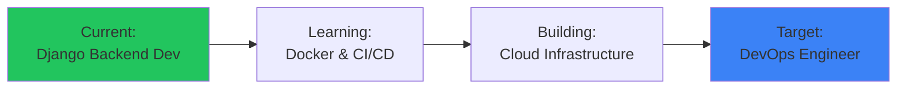

```python
import datetime

class BackendDev:
    def __init__(self):
        self.name = "Md Rabbi Islam (Primon)"
        self.title = "Django Backend Developer → DevOps"
        self.location = "Dhaka, Bangladesh"
        self.education = "B.Sc in Computer Science & Engineering"
        self.philosophy = "Code with purpose, deploy with confidence"
    
    def current_focus(self):
        return {
            "primary": "Building production-ready Django backends",
            "projects": ["AgroChain-BD", "LuxShop E-commerce"],
            "learning_path": "Transitioning to DevOps & Cloud Architecture"
        }
    
    def career_vision(self):
        return "Mastering scalable infrastructure to complement backend expertise"

dev = BackendDev()
```

<div align="center">
  
</div>

<div align="center">
  
### `Building robust systems today, scaling infrastructure tomorrow`
  
[](https://rabbi.crsyndicate.info)
[](mailto:rabbiprimon00000@gmail.com)
[](https://linkedin.com/in/md-rabbi-islam-747770231/)
[](https://github.com/RabbiPrimon)
[](https://www.hackerrank.com/profile/rabbiprimon00000)
[](https://leetcode.com/u/rabbiprimon/)
[](https://www.facebook.com/rabbi.primon)

</div>

---

## 🎯 About Me



## 🛠️ Tech Stack

### **Backend Development**


### **DevOps & Tools**


### **Frontend & Others**


## 📈 GitHub Stats

<div align="center">
  


</div>

## 🏆 Problem Solving Profiles

<div align="center">
  
[](https://leetcode.com/u/rabbiprimon/)
[](https://www.hackerrank.com/profile/rabbiprimon00000)

</div>

## 📂 Featured Projects

### **AgroChain-BD** - *Full-stack Agricultural E-commerce*
> Django, PostgreSQL, Redis, Celery, Docker
- Supply chain management for agricultural products
- Real-time inventory tracking & farmer-marketplace
- Dockerized microservices architecture

### **LuxShop E-commerce** - *Premium Online Store*
> Django, DRF, JWT, PostgreSQL, Bootstrap
- Complete e-commerce solution with admin dashboard
- Payment integration & order management
- RESTful API with comprehensive documentation

## 🎓 Education & Certifications

- **B.Sc in Computer Science & Engineering** - Ongoing
- **Python & Django Specialization** - Self-taught through projects
- **DevOps & Cloud Computing** - Currently pursuing practical experience

## 💡 Currently Learning

- Containerization with Docker & Kubernetes
- CI/CD Pipeline implementation
- AWS Cloud Services
- Microservices architecture
- System Design principles

## 📫 Let's Connect

- **Portfolio**: [rabbi.crsyndicate.info](https://rabbi.crsyndicate.info)
- **Email**: [rabbiprimon00000@gmail.com](mailto:rabbiprimon00000@gmail.com)
- **LinkedIn**: [Md Rabbi Islam](https://linkedin.com/in/md-rabbi-islam-747770231/)
- **Availability**: Open to backend development roles and DevOps opportunities

---

<div align="center">
  
*"Transforming complex problems into elegant solutions, one line of code at a time."*


</div>
